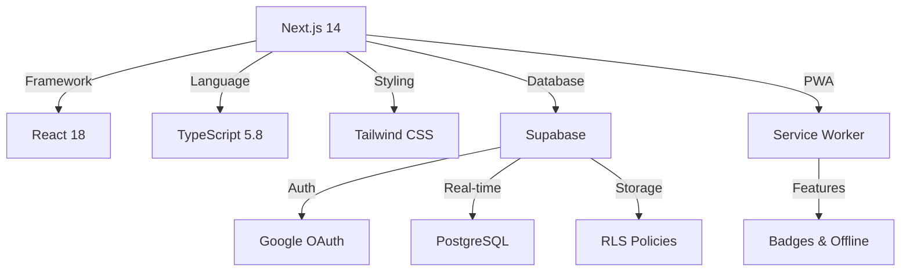

<div align="center">


# 🛒 רשימת קניות חכמה
### Smart Shopping List

**A modern, collaborative shopping list PWA built for families**  
*Real-time sync • Group sharing • Smart categorization • Hebrew RTL support*

[](https://nextjs.org/)
[](https://www.typescriptlang.org/)
[](https://supabase.com/)
[](https://web.dev/progressive-web-apps/)
[](LICENSE)

[🌐 Live Demo](https://shoppinglist-orpin.vercel.app) • [📖 Documentation](#-documentation) • [🚀 Quick Start](#-quick-start) • [💡 Features](#-features)


---

### 📸 Screenshots

<table>
<tr>
<td width="33%"></td>
<td width="33%"></td>
<td width="33%"></td>
</tr>
<tr>
<td align="center"><b>📱 Mobile First Design</b></td>
<td align="center"><b>✅ Real-time Updates</b></td>
<td align="center"><b>➕ Smart Input</b></td>
</tr>
</table>

</div>

---

## ✨ Features

<table>
<tr>
<td width="50%">

### 🎯 Core Functionality

🔄 **Real-time Collaboration**  
Share lists with family & friends. Everyone sees updates instantly.

👥 **Group Management**  
Create multiple groups for home, work, or specific occasions.

🏷️ **Smart Categories**  
Items auto-categorize with emoji icons for visual organization.

✅ **Completion Tracking**  
Mark items done with visual feedback and timestamp tracking.

�️ **Voice Input**  
Add items hands-free using speech recognition. Auto-adds when you finish speaking!

�🌐 **Hebrew RTL Support**  
Fully optimized right-to-left interface with Hebrew localization.

</td>
<td width="50%">

### 📱 Progressive Web App

📲 **Install Anywhere**  
Works on iOS 17+, Android, Windows, and macOS.

⚡ **Lightning Fast**  
Optimistic UI updates for instant feedback.

🔔 **Badge Notifications**  
Home screen badge shows uncompleted item count.

📴 **Offline Ready**  
Service worker caching for offline access.

🎨 **Native Feel**  
Beautiful, responsive UI that adapts to any screen.

</td>
</tr>
<tr>
<td width="50%">

### 🔐 Security & Auth

🔑 **Google OAuth**  
One-click sign-in with your Google account.

📧 **Email/Password**  
Traditional authentication for non-Google users.

🛡️ **Row Level Security**  
PostgreSQL RLS protects all data at database level.

🔒 **Privacy First**  
You only see your own groups and shared lists.

</td>
<td width="50%">

### 🎨 User Experience

🌙 **Modern Design**  
Glassmorphism effects, smooth animations, and gradients.

♿ **Accessible**  
ARIA labels, semantic HTML, keyboard navigation.

📱 **Mobile Optimized**  
Touch-friendly, compact design for small screens.

⚙️ **Customizable**  
Manage groups, members, and preferences easily.

</td>
</tr>
</table>

### 🎙️ Voice Input

**Hands-Free Shopping**
- 🎤 **Speech Recognition** - Add items by speaking
- ⚡ **Auto-Add Mode** - Items add automatically when you finish speaking
- 🔄 **Manual Mode** - Review items before adding (long-press to toggle)
- 🇮🇱 **Hebrew Support** - Optimized for Hebrew language recognition
- ✨ **Visual Feedback** - See recognized text before it's added

**How to Use:**
1. Tap the microphone button 🎙️
2. Say the item name (e.g., "חלב")
3. Stop speaking - item auto-adds in 0.5s!
4. Long-press mic button to toggle auto/manual mode

**Browser Support:**
- ✅ Chrome/Edge (Desktop & Mobile)
- ✅ Safari iOS 14.5+
- ✅ Android Chrome
- ❌ Firefox (not yet supported)

### 🔔 Badge Notifications

**Real-time Updates**
- Badge shows count of uncompleted items
- Updates automatically when items change
- Clears when all items are completed

**Cross-Platform Support**

| Platform | Badge Support | Version |
|----------|---------------|---------|
| iOS Safari | ✅ Native | 17+ |
| Android Chrome | ✅ Native | 109+ |
| Desktop Chrome/Edge | ✅ Native | All |
| Firefox | ⚠️ Title only | All |

**Fallback Methods**
1. Badging API (primary)
2. Service Worker messaging
3. Document title: `(3) רשימת קניות`
4. LocalStorage persistence

---

## 🚀 Quick Start

### 📋 Prerequisites

| Requirement | Version | Link |
|------------|---------|------|
| **Node.js** | 18+ | [Download](https://nodejs.org/) |
| **npm/yarn** | Latest | Included with Node.js |
| **Supabase Account** | Free tier OK | [Sign up](https://supabase.com) |

### ⚡ Installation

<details open>
<summary><b>Step 1: Clone & Install</b></summary>

```bash
# Clone the repository
git clone https://github.com/ShaharAssenheim/ShoppingList.git
cd ShoppingList

# Install dependencies
npm install
```

</details>

<details open>
<summary><b>Step 2: Environment Configuration</b></summary>

Create `.env.local` in the project root:

```env
# Supabase Configuration
NEXT_PUBLIC_SUPABASE_URL=https://your-project-id.supabase.co
NEXT_PUBLIC_SUPABASE_ANON_KEY=your-anon-key-here

# Production URL (set in Vercel for production)
# NEXT_PUBLIC_SITE_URL=https://your-domain.com
```

**🔍 Find your Supabase credentials:**
1. Go to [Supabase Dashboard](https://app.supabase.com)
2. Select your project
3. Go to **Settings** → **API**
4. Copy **Project URL** and **anon public** key

</details>

<details open>
<summary><b>Step 3: Database Setup</b></summary>

Open **Supabase SQL Editor** and run these files **in order**:

```sql
-- ⚠️ Step 1: Clear existing data (if any)
-- Run: db/step1-drop-everything.sql

-- Step 2: Create tables
-- Run: db/step2-create-tables.sql

-- Step 3: Setup RLS policies
-- Run: db/step3-create-simple-policies.sql

-- Step 4: Create helper functions
-- Run: db/step4-create-functions.sql
```

📖 **Detailed schema docs:** [db/README.md](db/README.md)

</details>

<details open>
<summary><b>Step 4: Configure Google OAuth (Optional)</b></summary>

1. Go to [Google Cloud Console](https://console.cloud.google.com)
2. Create a new project or select existing
3. Enable **Google+ API**
4. Create **OAuth 2.0 Client ID** credentials
5. Add authorized redirect URI:
   ```
   https://your-project-id.supabase.co/auth/v1/callback
   ```
6. Copy **Client ID** and **Client Secret**
7. In Supabase Dashboard → **Authentication** → **Providers**
8. Enable Google and paste credentials

</details>

<details open>
<summary><b>Step 5: Run Development Server</b></summary>
   ```bash
   npm run dev
   ```

6. **Open in browser**
   
   Navigate to [http://localhost:3000](http://localhost:3000)

---

## 📦 Tech Stack

<div align="center">



</div>

| Layer | Technology | Purpose | Version |
|-------|-----------|---------|---------|
| **Frontend** | Next.js | React framework with App Router | 14.2 |
| | TypeScript | Type-safe JavaScript | 5.8 |
| | Tailwind CSS | Utility-first styling | 3.4 |
| | React | UI library | 18.2 |
| **Backend** | Supabase | Backend-as-a-Service | Latest |
| | PostgreSQL | Relational database | 15+ |
| | Supabase Auth | Authentication provider | Built-in |
| | Supabase Realtime | WebSocket updates | Built-in |
| **PWA** | Service Worker | Offline caching & badges | Native |
| | Web App Manifest | Install metadata | JSON |
| **DevOps** | Vercel | Hosting & CI/CD | Latest |
| | Git | Version control | Latest |

---

## 📱 Install as PWA

### iOS (Safari)
1. Open the app in Safari
2. Tap the **Share** button (□↑)
3. Scroll down and tap **"Add to Home Screen"**
4. Tap **"Add"**
5. Badge will show uncompleted item count

### Android (Chrome)
1. Open the app in Chrome
2. Tap the menu (⋮)
3. Tap **"Install app"** or **"Add to Home Screen"**
4. Grant notification permission (optional, for enhanced badges)
5. Tap **"Install"**

### Desktop (Chrome/Edge)
1. Open the app in Chrome or Edge
2. Click the **install icon** (⊕) in the address bar
3. Click **"Install"**
4. Badge will appear on taskbar/dock

---

## 🗂️ Project Structure

```
smart-shopping-list/
├── app/                          # Next.js App Router
│   ├── layout.tsx               # Root layout with PWA meta tags
│   ├── page.tsx                 # Main page component
│   └── ServiceWorkerRegistration.tsx  # SW setup
├── components/
│   ├── AuthPage.tsx             # Login/signup UI
│   ├── GroupSetup.tsx           # Group creation flow
│   ├── Header.tsx               # App header with logout
│   ├── ItemInput.tsx            # Add item form
│   └── ShoppingItemRow.tsx      # Individual item component
├── contexts/
│   └── AuthContext.tsx          # Authentication state management
├── services/
│   ├── firebase.ts              # Legacy (not in use)
│   ├── geminiService.ts         # AI categorization service
│   └── supabase.ts              # Supabase client + CRUD operations
├── db/                          # Database migration files
│   ├── README.md                # Database documentation
│   ├── step1-drop-everything.sql
│   ├── step2-create-tables.sql
│   ├── step3-create-simple-policies.sql
│   └── step4-create-functions.sql
├── public/
│   ├── sw.js                    # Service Worker
│   ├── manifest.json            # PWA manifest
│   ├── icon-192.png             # App icon (192x192)
│   └── icon-512.png             # App icon (512x512)
├── App.tsx                      # Main shopping list component
├── types.ts                     # TypeScript type definitions
├── .env.local                   # Environment variables (not committed)
└── package.json
```

---

## 🔧 Configuration

### Database Schema

**Tables:**
- `user_profiles` — Extended user data
- `groups` — Shopping groups
- `group_members` — Group membership (junction table)
- `items` — Shopping list items

**Key Functions:**
- `create_group(group_name)` — Atomically create group + membership
- `leave_group(group_id)` — Remove user from group

**Security:**
- Row Level Security (RLS) on all tables
- Users can only access their own groups and items
- Owners can manage groups; members can CRUD items

📖 Full schema documentation: [db/README.md](db/README.md)

### Customize Badge Behavior

Edit badge logic in `App.tsx` (lines ~112-160):

```typescript
// Count only priority items
const activeCount = items.filter(i => !i.isCompleted && i.priority === 'high').length;

// Clear badge when app is visible
if (document.visibilityState === 'visible') {
  (navigator as any).clearAppBadge?.();
}
```

### Replace App Icons

Replace placeholder icons with actual PNG files:
- `public/icon-192.png` (192×192)
- `public/icon-512.png` (512×512)

Use [Real Favicon Generator](https://realfavicongenerator.net/) for best results.

---

## 🧪 Testing Badge Notifications

1. **Install as PWA** (not just a bookmark)
2. **Add items** to your shopping list
3. **Check badge** — Should show count immediately
4. **Complete items** — Badge decreases
5. **Complete all** — Badge clears

**Browser Console Testing:**
```javascript
// Check API support
console.log('Badge API:', 'setAppBadge' in navigator);

// Set badge manually
navigator.setAppBadge(5);

// Clear badge
navigator.clearAppBadge();
```

---

## 🐛 Troubleshooting

<details>
<summary><strong>Badge not showing</strong></summary>

- ✅ App must be installed as PWA (not bookmarked)
- ✅ Check browser supports Badging API
- ✅ iOS requires 17+, Android Chrome 109+
- ✅ Verify items are loaded correctly
</details>

<details>
<summary><strong>HTTP 500 errors on database queries</strong></summary>

- ✅ Run all 4 SQL migration files in order
- ✅ Check RLS policies are created
- ✅ Verify user is authenticated (`auth.uid()` returns ID)
- ✅ Clear old data with `step1-drop-everything.sql`
</details>

<details>
<summary><strong>Groups not appearing</strong></summary>

- ✅ User must be member of group (check `group_members` table)
- ✅ Groups must be created via `create_group()` function
- ✅ Check RLS policies allow SELECT for current user
</details>

<details>
<summary><strong>Items not saving</strong></summary>

- ✅ User must be member of target group
- ✅ Verify `items` RLS policies are active
- ✅ Check browser console for errors
- ✅ Ensure group_id is valid
</details>

<details>
<summary><strong>Logout button not working</strong></summary>

- ✅ Check browser console for errors
- ✅ Verify Supabase client is initialized
- ✅ Clear browser cache and localStorage
</details>

---

## 🛠️ Development

### Run Development Server
```bash
npm run dev
```

### Build for Production
```bash
npm run build
npm run start
```

### Clear Next.js Cache
```bash
Remove-Item ".next" -Recurse -Force
```

### Reset Database
```bash
# In Supabase SQL Editor, run in order:
# 1. db/step1-drop-everything.sql
# 2. db/step2-create-tables.sql
# 3. db/step3-create-simple-policies.sql
# 4. db/step4-create-functions.sql
```

---

## 🚀 Deployment

### Deploy to Vercel (Recommended)

<div align="center">

[](https://vercel.com/new/clone?repository-url=https://github.com/ShaharAssenheim/ShoppingList)

</div>

**One-Click Deploy:**
1. Click "Deploy" button above
2. Connect your GitHub account
3. Configure environment variables:
   - `NEXT_PUBLIC_SUPABASE_URL`
   - `NEXT_PUBLIC_SUPABASE_ANON_KEY`
   - `NEXT_PUBLIC_SITE_URL` (your production URL)
4. Click Deploy and wait ~2 minutes
5. ✅ Done! Your app is live

### Supabase Configuration for Production

⚠️ **Important:** After deployment, update Supabase settings:

1. Go to **Supabase Dashboard** → **Authentication** → **URL Configuration**
2. Set **Site URL** to your production domain:
   ```
   https://your-app.vercel.app
   ```
3. Add to **Redirect URLs**:
   ```
   https://your-app.vercel.app/**
   ```
4. Save changes

### Alternative Hosting Platforms

<details>
<summary><b>Netlify</b></summary>

```bash
npm run build
netlify deploy --prod --dir=.next
```

</details>

<details>
<summary><b>Custom Server</b></summary>

```bash
# Build the app
npm run build

# Start production server
npm run start
```

</details>

<details>
<summary><b>Docker</b></summary>

```dockerfile
FROM node:18-alpine
WORKDIR /app
COPY package*.json ./
RUN npm ci --only=production
COPY . .
RUN npm run build
EXPOSE 3000
CMD ["npm", "start"]
```

</details>

---
x] 🎙️ **Voice input for adding items** - ✅ Completed!
- [ ] 🌙 Dark mode support
- [ ] 🔍 Search and filter items
- [ ] 📊 Shopping history and analytics
- [ ] 🏪 Store locations integration
- [ ] 💰 Price tracking and budgets
- [ ] 📸 Image attachments fortion
- [ ] 💰 Price tracking and budgets
- [ ] 📸 Image attachments for items
- [ ] 🎙️ Voice input for adding items
- [ ] 🌍 Multi-language support (beyond Hebrew)
- [ ] 📱 Native mobile apps (React Native)
- [ ] 🤖 AI-powered recipe-to-list conversion

---

## 🤝 Contributing

We love contributions! Whether it's bug fixes, new features, or documentation improvements.

### How to Contribute

1. **Fork** the repository
2. **Create** a feature branch
   ```bash
   git checkout -b feature/amazing-feature
   ```
3. **Make** your changes
4. **Test** thoroughly
5. **Commit** with clear messages
   ```bash
   git commit -m 'Add amazing feature'
   ```
6. **Push** to your fork
   ```bash
   git push origin feature/amazing-feature
   ```
7. **Open** a Pull Request

### Contribution Guidelines

- ✅ Follow TypeScript best practices
- ✅ Maintain existing code style
- ✅ Add comments for complex logic
- ✅ Test on mobile and desktop
- ✅ Update documentation as needed
- ✅ Ensure all tests pass

### Areas We Need Help

- 🌐 Translations (English, Arabic, etc.)
- 🎨 UI/UX improvements
- 📝 Documentation
- 🐛 Bug reports and fixes
- ✨ Feature suggestions

---

## 📄 License

This project is open source and available under the [MIT License](LICENSE).

```
MIT License - Feel free to use this project for personal or commercial purposes.
```

---

## 👨‍💻 Author & Maintainer

<div align="center">

**Shahar Assenheim**

[](https://github.com/ShaharAssenheim)
[](https://github.com/ShaharAssenheim)
[](mailto:assenheim.shahar@gmail.com)

💼 Full-stack developer passionate about building practical tools that make life easier.

</div>

---

## 🙏 Acknowledgments

Special thanks to the amazing open-source community and these technologies:

<table>
<tr>
<td align="center" width="33%">

<br><b>Next.js</b>
<br>React framework
</td>
<td align="center" width="33%">

<br><b>Supabase</b>
<br>Backend platform
</td>
<td align="center" width="33%">

<br><b>Tailwind CSS</b>
<br>Styling framework
</td>
</tr>
<tr>
<td align="center" width="33%">

<br><b>TypeScript</b>
<br>Type safety
</td>
<td align="center" width="33%">

<br><b>Vercel</b>
<br>Hosting & deployment
</td>
<td align="center" width="33%">

<br><b>React</b>
<br>UI library
</td>
</tr>
</table>

---

## ⭐ Show Your Support

If this project helped you, please consider giving it a ⭐️!

<div align="center">

[](https://github.com/ShaharAssenheim/ShoppingList/stargazers)
[](https://github.com/ShaharAssenheim/ShoppingList/network/members)
[](https://github.com/ShaharAssenheim/ShoppingList/watchers)

### 🚀 Ready to get started?

[📖 Read the Docs](#-quick-start) • [🐛 Report Bug](https://github.com/ShaharAssenheim/ShoppingList/issues) • [💡 Request Feature](https://github.com/ShaharAssenheim/ShoppingList/issues)

---

Made with ❤️ and ☕ in Israel

**Happy Shopping!** 🛒✨

</div>
